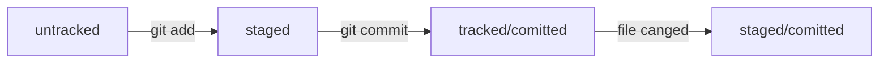

# HELP ABOUT GIT

1. Download from official site (__https://git-scm.com/download/win__) and install Git.
2. **Запустите Git:  Перейдите в C:\Program Files\Git\bin и запустите файл bash.exe. Откроется консоль.**
   - Консоль, терминал, или командная строка, — это программа, которая считывает команду пользователя и выполняет её.
   - Чтобы вывести текущую рабочую директорию, можно использовать команду pwd.
   - У большинства пользователей компьютера есть доступ к домашней директории. Чтобы к ней перейти, используют команду cd ~.
3.  **Через консоль вы можете выполнять те же операции, что и с помощью классических средств работы с операционной системой.** А именно:
   - менять директории командой cd;
   - выводить содержимое директорий с помощью ls;
   - просматривать содержимое вместе со скрытыми файлами и папками через ls -a.
   - Команда touch создаёт файл, а команда mkdir — директорию.
   - С помощью флага -p можно создать целую структуру директорий одной командой: mkdir -p.
   - Для копирования файлов используют команду cp, для перемещения — mv
   - Вывести содержимое файла можно командой cat.
   - Для удаления файла используют rm, для удаления пустой директории — rmdir, а для директории с файлами — rm -r.
   - Все команды удаления стирают данные безвозвратно — их нельзя будет восстановить из корзины!
   - С помощью && можно выполнить несколько команд сразу — одну за другой.
   - Команды, которые вы выполняете в консоли, попадают в историю. Вы можете перемещаться по этой истории при помощи стрелок ↑↓.
   - При нажатии на Tab консоль предложит несколько вариантов продолжения команды.
   - Символами / и ~ можно быстро перемещаться к корневой и домашней директориям.
   * Если в названии папки есть пробелы, нужно использовать кавычки.
4. **Настройка Git возможна с помощью командной строки.**
   - Файл .gitconfig используется для хранения глобальных настроек Git.
   - Git config --global позволяет указать имя пользователя и электронную почту (user.name=Username, 
user.email=username@yandex.ru ).
   - Имя и почта записываются в файл .gitconfig в домашней директории.
   - Для проверки настроек можно использовать git config --list.
5. **Инициализая репозитария.**
   - Инициализировать репозиторий можно с помощью команды git init.
   - Проверить статус, или состояние, репозитория поможет команда git status.
   - Если вы ошиблись и случайно инициализировали не ту папку, можно «разгитить» её — удалить скрытую подпапку .git.
6. **Работа с Git**
   - Команда ***git add*** позволяет подготовить файл к сохранению.
   - Команда git add --all подготовит к сохранению сразу все файлы.
   - С помощью git add . можно добавить в репозиторий текущую папку со всеми файлами.
   - Коммит можно сделать с помощью команды ***git commit***.
   - Ключ -m позволяет присвоить коммиту сообщение (***git commit -m ‘Описание’***). 
Помните, что такие сообщения должны быть информативными: чётко описывать изменения.
   - Команда ***git log*** — используйте её, чтобы оглянуться назад и посмотреть коммиты.
7. GitHub как связать и синхронизовать локальный и удаленный репозитарии
   - GitHub — платформа, которая работает с Git и упрощает командное взаимодействие.
Кроме GitHub, существуют и другие подобные платформы, например GitLab, Bitbucket и так далее.
   - Git — это консольный инструмент для работы с локальными и удалёнными репозиториями. 
Он не связан напрямую ни с одной из платформ и развивается отдельно от них.
   - SSH — протокол, который обеспечивает безопасный обмен данными в сети и использует для этого ключи. 
SSH-ключ состоит из двух частей — публичной и приватной. 
Публичный ключ зашифрует данные, а приватный — расшифрует. Приватным ключом ни в коем случае нельзя делиться, 
иначе любой сможет расшифровать все ваши секреты!
   - Cкопируйте содержимое публичного ключа id_ed25519.pub в буфер обмена. Перейдите на GitHub и выберите пункт SSH and GPG keys в меню аккаунта.
В поле Key скопируйте ваш ключ из буфера обмена. Нажмите на кнопку Add SSH key. 
Проверьте правильность ключа с помощью команды ***ssh -T git@github.com***.
   - Откройте консоль, перейдите в каталог локального репозитория и введите команду git remote add (от англ. remote — «удалённый» и add — «добавить»)
***$ git remote add origin https://github.com/твой_аккаунт/имя_репозитория.git ***
   - Проверка подключения ***git remote -v***
   - Синхронизация ***git push*** (первый раз *git push -u origin master/main*)
8. Хеш
   - Git преобразует информацию о коммитах с помощью алгоритма SHA-1 и для каждого из них рассчитывает уникальный идентификатор — хеш.
   - Хеш — основной идентификатор коммита и позволяет узнать его автора, дату и содержимое закоммиченных файлов.
   - Все хеши, а также таблицу соответствий хеш → информация о коммите Git хранит в папке **.git**.
9. Сокращенный лог.
   - Можно вызвать не только полный лог, но и сокращённый — это делается командой ***git log --oneline***.
   - В сокращённом логе выводятся сокращённые хеши — их можно использовать точно так же, как и полные.
10. HEAD
   - В числе прочих файлов в папке .git есть служебный файл **HEAD**. Он указывает на самый свежий коммит.
   - Вместо хеша последнего коммита можно написать слово **HEAD** — Git вас поймёт.
11. Статусы файлов.
   - Статусом untracked помечается файл, о существовании которого Git знает, но не следит за изменениями в нём. 
Этот статус — противоположность tracked, в который попадают все файлы, отслеживаемые Git.
   - Файл переходит в статус staged после выполнения git add.
   - Статус modified означает, что файл был изменён.
   - Большинство файлов в проектах «шагает» по следующему циклу: 
* «изменён» → «добавлен в список на коммит» → «закоммичен» → «изменён» → и так далее.

12. Статусы файлов.
   - Команда git status всегда подскажет, что происходит с файлом: например, он добавлен в список «на коммит» или 
ещё вообще не отслеживается, или изменён.
   - git status показывает явно следующие состояния файлов: untracked, staged и modified.
   - git status подсказывает, какие команды можно выполнить, чтобы поменять состояние файла.
13. Правильное описание коммита:
   - сообщение коммита легко читается;
   - оно информативное;
   - все сообщения оформлены в одном стиле.
   - Есть разработанные стили сообщений коммита.